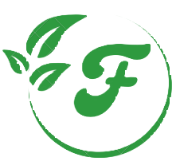
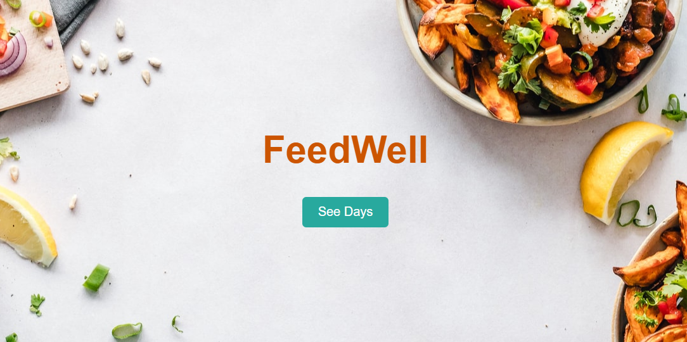

[![Contributors][contributors-shield]][contributors-url]
[![Forks][forks-shield]][forks-url]
[![MIT License][license-shield]][license-url]
[![LinkedIn][linkedin-shield]][linkedin-url]


<!-- PROJECT LOGO -->
<br />
<p align="center">
  
</p>
  
<h2 align="center">FeedWell</h2>

  <p align="center">
    A weekly meal planner App
    <br />
 


<!-- TABLE OF CONTENTS -->
<details open="open">
  <summary>Table of Contents</summary>
  <ol>
    <li>
      <a href="#about-the-project">About The Project</a>
      <ul>
        <li><a href="#built-with">Built With</a></li>
      </ul>
    </li>
    <li>
      <a href="#getting-started">Getting Started</a>
      <ul>
        <li><a href="#prerequisites">Prerequisites</a></li>
        <li><a href="#installation">Installation</a></li>
      </ul>
    </li>
    <li><a href="#usage">Usage</a></li>
    <li><a href="#contributing">Contributing</a></li>
    <li><a href="#license">License</a></li>
    <li><a href="#contact">Contact</a></li>
    <li><a href="#acknowledgements">Acknowledgements</a></li>
  </ol>
</details>


<!-- ABOUT THE PROJECT -->
## About The Project



This meal planner is a Single Page Application (SPA) created using React. It allows users to plan their meals for the week and also provides a simple and user-friendly interface where users can input and track their meal options for each day. 

### Built With


* [React](https://react.dev/)


<!-- GETTING STARTED -->
## Getting Started


To get the app up and running follow these simple  steps.

### Prerequisites

* npm
  ```sh
  npm install npm@latest -g
  ```

### Installation


1. Clone the repo
   ```sh
   git clone https://github.com/Lady-Bee/feedwell.git
   ```
2. Install NPM packages
   ```sh
   npm install
   ```
3. Cd into the project folder
   ```
   cd feedwell
   ```
4. Start the app
   ```
   npm start
   ```


<!-- USAGE EXAMPLES -->
## Usage

Use this space to show useful examples of how a project can be used. Additional screenshots, code examples and demos work well in this space. You may also link to more resources.

_For more examples, please refer to the [Documentation](https://example.com)_


<!-- CONTRIBUTING -->
## Contributing

We are looking to add more features to this project but will definitely
open it to contributions at its completion


<!-- LICENSE -->
## License

Distributed under the MIT License. See `LICENSE` for more information.


<!-- CONTACT -->
## Contact

Bisola Adeboye 

Connect  on [Linkedin](https://www.linkedin.com/in/bisolaadeboye/)

Project Link: [feedwell](https://github.com/Lady-Bee/feedwell.git)


<!-- ACKNOWLEDGEMENTS -->
## Acknowledgements
* [FreecodeCamp](https://www.freecodecamp.org/news/how-to-write-a-good-readme-file/)
* [Unsplash](https://unsplash.com/)
* [w3schools](https://www.w3schools.com/REACT/default.asp)
* [Google Images](https://images.google.com/)
* [Choose an open Source License](https://choosealicense.com)          


<!-- MARKDOWN LINKS & IMAGES -->
<!-- https://www.markdownguide.org/basic-syntax/#reference-style-links -->
[contributors-shield]: https://img.shields.io/github/contributors/Lady-Bee/feedwell.svg?style=for-the-badge
[contributors-url]: https://github.com/Lady-Bee/feedwell/graphs/contributors
[forks-shield]: https://img.shields.io/github/forks/Lady-Bee/feedwell.svg?style=for-the-badge
[forks-url]: https://github.com/Lady-Bee/feedwell/network/members
[license-shield]: https://img.shields.io/github/license/Lady-Bee/feedwell.svg?style=for-the-badge
[license-url]: https://github.com/Lady-Bee/feedwell/blob/main/LICENSE.txt
[linkedin-shield]: https://img.shields.io/badge/-LinkedIn-black.svg?style=for-the-badge&logo=linkedin&colorB=555
[linkedin-url]: https://www.linkedin.com/in/bisolaadeboye/